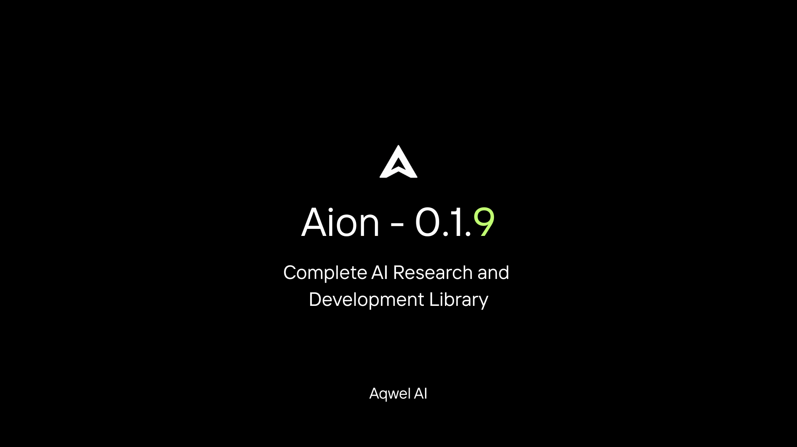
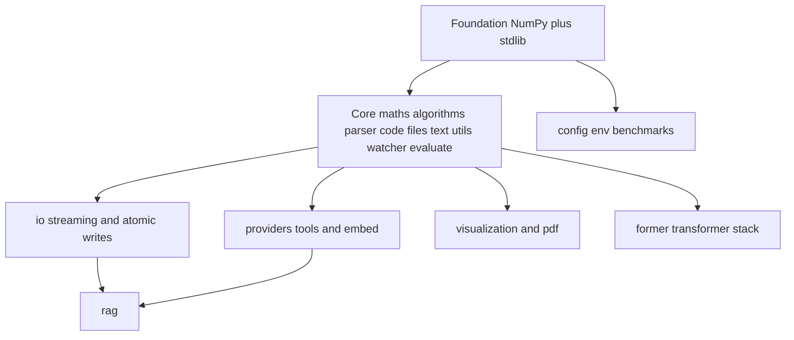
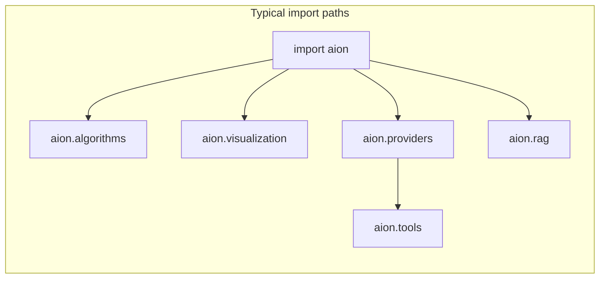
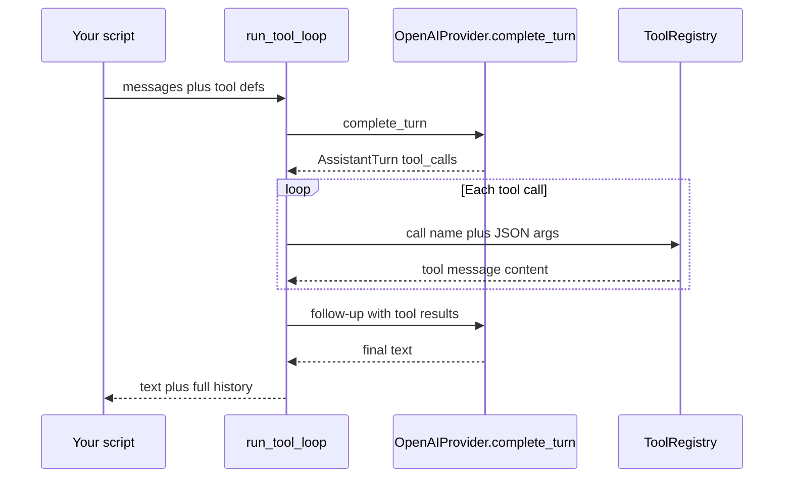
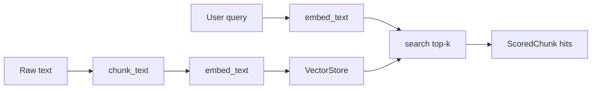

# Aqwel-Aion

**Aqwel-Aion v0.1.9 — Complete AI Research and Development Library**

[](https://pypi.org/project/aqwel-aion/)
[](https://pypi.org/project/aqwel-aion/)
[](LICENSE)

Aion is an open-source Python library by **Aqwel AI** for research and production-style ML workflows: numerics and algorithms, **safe I/O**, **multi-vendor LLM clients**, **tool calling and RAG primitives**, visualization (including **3D** and multi-page reports), optional **native-accelerated** helpers, and small **infra utilities** (config, env, logging, benchmarks). Install only the extras you need—core usage stays lightweight.

**Links:** [Website](https://aqwelai.xyz/) · [Documentation](https://aqwelai.xyz/#/docs) · [PyPI](https://pypi.org/project/aqwel-aion/)

---

## Team Aqwel AI

| Name | Role | GitHub | LinkedIn |
|------|------|--------|----------|
| Aksel Aghajanyan | CEO & Main Developer, AI Researcher  | [@Aksel588](https://github.com/Aksel588) | [Aksel Aghajanyan](https://www.linkedin.com/in/aksel-aghajanyan/) |
| Georgi Martirosyan | Developer | [@MrGeorge084](https://github.com/MrGeorge084) | [Georgi Martirosyan](https://www.linkedin.com/in/georgi-martirosyan-9038a43a6/) |
| Arthur Karapetyan | Developer | [@ArthurKarapetyan17](https://github.com/ArthurKarapetyan17) | [Arthur Karapetyan](https://www.linkedin.com/in/arthur-karapetyan-53b920385/) |
| David Avanesyan | Developer | [@dav1t1](https://github.com/dav1t1) | [Davit Avanesyan](https://www.linkedin.com/in/դավիթ-ավանեսյան-9a6a733a4/) |

**Author:** Aksel Aghajanyan · **Developed by:** Aqwel AI Team

---

## Table of Contents

- [Team Aqwel AI](#team-aqwel-ai)
- [Overview](#overview)
- [What's new in 0.1.9](#whats-new-in-019)
- [Architecture and structure](#architecture-and-structure)
- [Package architecture and diagrams](#package-architecture-and-diagrams)
- [Optional dependency matrix](#optional-dependency-matrix)
- [Requirements](#requirements)
- [Installation](#installation)
- [Getting Started](#getting-started)
- [Features](#features)
- [Usage Examples](#usage-examples)
- [Module Reference](#module-reference)
- [Supported Languages](#supported-languages)
- [Documentation and Resources](#documentation-and-resources)
- [What shows on GitHub](#what-shows-on-github)
- [Contributing](#contributing)
- [Author and License](#author-and-license)
- [Library Statistics](#library-statistics)

---

## Overview

Aion gives you one coherent **import surface** (`import aion`) for work that usually spans half a dozen ad-hoc utilities: **linear algebra and stats**, **classical algorithms** (search, arrays, **graphs** with shortest paths and components), **plotting** (1D/2D/training/**3D**, PDF/HTML figure bundles), **embeddings and evaluation**, **PDF/docs generation**, and **systems-style helpers** (files, watcher, Git).

**LLM-era additions** in recent releases include **`aion.providers`** (REST chat for OpenAI, Gemini, Anthropic, and OpenAI-compatible servers), **`aion.tools`** (schemas, registry, multi-turn **tool loops** with `complete_turn`), **`aion.rag`** (chunking, **vector stores**, optional FAISS, `SimpleRAGIndex`), plus **`aion.io`** for streaming reads, atomic writes, and checksums. **Developer experience** modules cover **config** (TOML/YAML + env merge), **`.env` loading**, **benchmarks**, and **`FakeToolProvider`** under **`aion.tools`** for offline tool-loop demos. Use the standard library **`logging`** for log configuration.

The design goal is simple: **progressive disclosure**—core installs stay small; heavy stacks are behind **named extras** (`[viz]`, `[ai]`, `[full]`, `[tools]`, `[rag]`, and others).

---

## What's new in 0.1.9

- **`aion.io`** — Streaming line/chunk reads, atomic writes (`atomic_write`, `atomic_write_bytes`, `save_automatically`), and SHA-256 file hashing/verification.
- **`aion.providers`** — Chat-style clients for OpenAI, Google Gemini, Anthropic, and OpenAI-compatible HTTP APIs; factory helpers (`create_provider`, `supported_providers`) and typed errors (`ProviderError`). API keys use the usual vendor environment variables (see module docstrings).
- **Optional native numerics** — `aion._core` (re-exported on `aion`) exposes reductions and vector ops: `fast_sum`, `fast_dot`, `fast_mean`, `fast_variance`, `fast_norm2`, `fast_norm1`, `fast_argmax`, `fast_argmin`, `fast_min`, `fast_max`, `fast_relu`, `fast_softmax`, `fast_sigmoid`, `fast_tanh`, `fast_clip`, `fast_cumsum`, `fast_matrix_vector_mul`, `fast_lower_bound`, `fast_upper_bound`, plus `using_native_extension`. Uses `aion._aion_core` when built with pybind11; otherwise NumPy fallbacks.
- **Documentation helpers (`aion.pdf`)** — Static HTML API pages (`create_api_documentation_html`), symbol search (`search_public_api`), per-module references (`create_module_reference_doc`), Markdown API index export (`export_api_index(..., format="md")`), optional **class** introspection (`generate_module_documentation(..., include_classes=True)`), and INDEX entries for HTML / Markdown artifacts.
- **Tests** — When a top-level `tests/` tree is present, run with `pytest` after `pip install -e ".[dev]"`.
- **`aion.tools`** — `function_tool`, `ToolRegistry`, `run_tool_loop` with `OpenAIProvider.complete_turn`; `post_json_with_retry`, `TokenBucket`, optional token estimates (`[tools]` → tiktoken).
- **`aion.rag`** — `chunk_text`, `MemoryVectorStore`, `FaissVectorStore` (if FAISS installed), `SimpleRAGIndex` (`[rag]` extra).
- **`aion.config` / `aion.env`** — Load TOML/YAML, deep-merge layered configs, dotted key access, merge `AION_*` env overrides, optional string→bool/number coercion; parse `.env`. Notebook: `aion/config/examples/01_config_loading_merge.ipynb`.
- **`aion.benchmarks`** — Timings and NumPy vs `fast_*` comparisons. Offline tool-loop demos use **`aion.tools.FakeToolProvider`** / **`make_tool_turn`**. Package version: **`import aion; aion.__version__`**.
- **Graphs** — `dijkstra`, `connected_components`, `shortest_path_unweighted`.
- **Visualization** — `plot_3d_scatter`, `plot_3d_surface`, `save_figures_pdf`, `figures_to_html_img_tags`.
- **Providers** — Structured `complete_turn` → `AssistantTurn` with `tool_calls` (OpenAI + OpenAI-compatible).

---

## Architecture and structure

This part of the README is the **structural map** of Aion: conceptual layers (diagrams), design rules, and a **file-level tree** of the `aion/` package that matches the repository.

### Package architecture and diagrams

The diagrams below are [Mermaid](https://mermaid.js.org/)—they render on GitHub and in many Markdown viewers.

#### Layered stack (how capabilities build on each other)



#### Conceptual module map (import-oriented)



#### Tool-calling loop (OpenAI-shaped providers)



#### RAG pipeline (reference implementation)



### High-level design

- **Single package:** Public APIs live under `aion`. Prefer `import aion` and attribute access, or explicit `from aion.X import …` for subpackages.
- **Core single-file modules:** `maths`, `code`, `embed`, `evaluate`, `files`, `git`, `parser`, `pdf`, `prompt`, `snippets`, `text`, `utils`, `watcher`, `cli`, plus **`_core`** (`fast_*` bridge to optional native code).
- **Data and control plane:** `io` (streaming, atomic writes, checksums), `config` (implementation in `config/core.py`), `env`.
- **LLM surface:** `providers` (chat REST, `complete` and `complete_turn` where supported), `tools` (OpenAI-style tool JSON, registry, retries, token bucket, optional tiktoken).
- **Retrieval:** `rag` (chunking, `MemoryVectorStore`, optional `FaissVectorStore`, `SimpleRAGIndex`).
- **Algorithms and visualization:** `algorithms` (search, arrays, **graphs**: BFS, DFS, toposort, Dijkstra, components, unweighted shortest path), `visualization` (1D/2D/training/**3D**, `save_figures_pdf`, HTML figure bundles).
- **Former:** NumPy autograd transformer training (`aion.former.*`), including **`aion.former.datasets`** for tokenizer and text windows.
- **Quality:** `benchmarks`.
- **Optional dependencies:** Heavy stacks behind extras (`[viz]`, `[ai]`, `[docs]`, `[full]`, `[tools]`, `[rag]`, `[config]`, …). LLM calls need network + API keys. **No `eval`** in tool execution—arguments are JSON-parsed and passed to registered callables only.
- **Native extension:** `src/aion_core.cpp` + pybind11 produces `aion._aion_core`; otherwise NumPy fallbacks.
- **Entry points:** `aion.cli`, package metadata on `aion`, and repo `main.py` for CLI experiments.

### Directory structure

Layout below matches the repository as shipped (file names only; omit your local `.venv`, build artifacts, and caches).

#### Repository root

```
.                              # Project root (clone / sdist)
├── README.md
├── 0.1.9.png                  # README banner (release hero image)
├── LICENSE
├── CHANGELOG.md
├── CONTRIBUTING.md
├── MANIFEST.in
├── pyproject.toml
├── setup.py
├── requirements.txt
├── example.py                 # Runnable demo (algorithms / visualization)
├── main.py                    # CLI entry script
├── src/
│   └── aion_core.cpp          # C++ sources for optional aion._aion_core (pybind11)
├── tests/                     # Pytest suite (when present in your clone)
│   └── …
└── aion/                      # Python package (see next tree)
```

**Repo check:** The layout above is the **documented** shipping shape. The current Git tree may **omit** a top-level `tests/` directory (CONTRIBUTING still describes adding pytest there). If `import aion` fails after a partial checkout, restore package stubs with  
`git checkout HEAD -- aion/benchmarks/__init__.py`.  
The library surface is **`aion.code`** (`code.py`); ignore a stray local `aion/code/` folder if it only contains `__pycache__`.

#### Package `aion/` (complete source tree)

Top-level names follow **lexicographic** order (`ls | sort`). This tree reflects the **current** repository layout, including LLM tools, RAG, infra, and 3D/report visualization.

```
aion/
├── __init__.py                # Version, metadata, public submodule exports
├── _core.py                   # fast_* → optional aion._aion_core or NumPy
├── algorithms/
│   ├── README.md
│   ├── __init__.py
│   ├── arrays.py
│   ├── examples/
│   │   ├── README.md
│   │   ├── 01_search_algorithms.ipynb
│   │   └── 02_array_utilities.ipynb
│   ├── graphs.py              # bfs, dfs, toposort, dijkstra, connected_components, …
│   └── search.py
├── benchmarks/
│   └── __init__.py            # timed_run, compare_sum_numpy_vs_fast
├── cli.py
├── code.py
├── config/
│   ├── README.md
│   ├── __init__.py            # Re-exports from core ([config] extra)
│   ├── core.py                # TOML/YAML, deep merge, env merge, dotted keys
│   └── examples/
│       ├── README.md
│       ├── __init__.py
│       ├── 01_config_loading_merge.ipynb
│       ├── sample.toml
│       └── sample_override.yaml
├── embed.py
├── env/
│   └── __init__.py            # load_dotenv_file, require_env
├── evaluate.py
├── files.py
├── former/
│   ├── README.md
│   ├── __init__.py
│   ├── core/
│   │   ├── README.md
│   │   ├── __init__.py
│   │   ├── autograd.py
│   │   ├── operations.py
│   │   ├── tensor.py
│   │   └── examples/
│   │       ├── README.md
│   │       ├── __init__.py
│   │       └── demo_tensor.py
│   ├── datasets/
│   │   ├── README.md
│   │   ├── __init__.py
│   │   ├── loader.py
│   │   ├── tokenizer.py
│   │   └── examples/
│   │       ├── README.md
│   │       ├── __init__.py
│   │       └── demo_tokenizer.py
│   ├── docs/
│   │   └── architecture.md
│   ├── example.py
│   ├── example_attention.png      # Sample attention figure (docs / previews)
│   ├── example_training_metrics.png
│   ├── examples/
│   │   ├── README.md
│   │   ├── __init__.py
│   │   ├── attention_demo.py
│   │   ├── attention_demo_all_heads.png
│   │   ├── attention_demo_head0.png
│   │   └── text_generation.py
│   ├── examples_results/
│   │   ├── README.md
│   │   ├── example_attention.png
│   │   └── example_training_metrics.png
│   ├── experiments/
│   │   ├── README.md
│   │   ├── __init__.py
│   │   ├── config.yaml
│   │   ├── train_small_model.py
│   │   └── examples/
│   │       ├── README.md
│   │       ├── __init__.py
│   │       └── demo_config.py
│   ├── models/
│   │   ├── README.md
│   │   ├── __init__.py
│   │   ├── attention.py
│   │   ├── embedding.py
│   │   ├── feedforward.py
│   │   ├── transformer.py
│   │   └── examples/
│   │       ├── README.md
│   │       ├── __init__.py
│   │       └── demo_forward.py
│   ├── training/
│   │   ├── README.md
│   │   ├── __init__.py
│   │   ├── checkpoint.py    # weights npz + save_checkpoint_sidecar_meta
│   │   ├── loss.py
│   │   ├── optimizer.py
│   │   ├── trainer.py
│   │   └── examples/
│   │       ├── README.md
│   │       ├── __init__.py
│   │       └── demo_loss.py
│   └── visualization/
│       ├── README.md
│       ├── __init__.py
│       ├── attention_map.py
│       ├── training_metrics.py
│       ├── weight_spectrum.py
│       └── examples/
│           ├── README.md
│           ├── __init__.py
│           └── demo_attention_plot.py
├── git.py
├── io/
│   ├── README.md
│   ├── __init__.py
│   ├── atomic.py
│   ├── checksum.py
│   ├── streaming.py
│   └── examples/
│       ├── README.md
│       ├── __init__.py
│       └── demo_atomic_checksum.py
├── maths.py
├── parser.py
├── pdf.py
├── prompt.py
├── providers/
│   ├── README.md
│   ├── __init__.py
│   ├── anthropic_provider.py
│   ├── base.py
│   ├── errors.py
│   ├── factory.py
│   ├── gemini_provider.py
│   ├── generic_openai.py
│   ├── http_utils.py
│   ├── openai_provider.py
│   ├── structured.py          # AssistantTurn, NormalizedToolCall, parse_chat_completion_response
│   └── examples/
│       ├── README.md
│       ├── __init__.py
│       └── demo_factory_parse.py
├── rag/
│   ├── README.md
│   ├── __init__.py
│   ├── chunking.py
│   ├── pipeline.py            # SimpleRAGIndex
│   ├── types.py               # VectorStore, ScoredChunk
│   ├── stores/
│   │   ├── __init__.py
│   │   ├── faiss_store.py
│   │   └── memory.py
│   └── examples/
│       ├── README.md
│       ├── __init__.py
│       └── demo_simple_index.py
├── snippets.py
├── text.py
├── tools/
│   ├── README.md
│   ├── __init__.py
│   ├── fake_provider.py       # FakeToolProvider, make_tool_turn (offline demos)
│   ├── loop.py                # run_tool_loop
│   ├── rate_limit.py
│   ├── registry.py
│   ├── retry.py
│   ├── schemas.py
│   ├── tokens.py
│   └── examples/
│       ├── README.md
│       ├── __init__.py
│       └── demo_tool_loop.py
├── utils.py
├── visualization/
│   ├── README.md
│   ├── __init__.py
│   ├── arrays.py
│   ├── classification.py
│   ├── examples/
│   │   ├── README.md
│   │   ├── 01_array_visualization.ipynb
│   │   ├── 02_matrix_visualization.ipynb
│   │   └── 03_training_visualization.ipynb
│   ├── examples_visualization/  # committed plot previews (*.png)
│   │   ├── example_array.png
│   │   ├── example_array_mean.png
│   │   ├── example_confusion_matrix.png
│   │   ├── example_histogram.png
│   │   ├── example_matrix_heatmap.png
│   │   ├── example_multiple_arrays.png
│   │   ├── example_scatter.png
│   │   └── example_training_history.png
│   ├── matrices.py
│   ├── report.py              # save_figures_pdf, figures_to_html_img_tags
│   ├── three_d.py             # plot_3d_scatter, plot_3d_surface
│   ├── training.py
│   └── utils.py
└── watcher.py
```

After a local build, you may also see **`aion/_aion_core*.so`** (macOS/Linux) or **`aion/_aion_core*.pyd`** (Windows) next to these sources; those binaries are compiled outputs, not part of the documented source tree. **`__pycache__/`** is created at import time.

**Current `aion` surface (trimmed layout):** Subpackages on disk are **`algorithms`**, **`benchmarks`**, **`config`**, **`env`**, **`former`**, **`io`**, **`providers`**, **`rag`**, **`tools`**, and **`visualization`**, plus the single-file modules shown above (`maths.py`, `code.py`, …). There is **no** top-level **`aion.datasets`** or **`aion.dataframe`**; tabular/JSONL loading is left to the stdlib or **pandas**, and Former keeps **`aion.former.datasets`** for tokenizer + LM windows only. Removed helper packages (**`logging_utils`**, **`metrics`**, **`packaging`**, **`serialization`**, **`testing`**) are gone—use **`logging`**, **`aion.evaluate`**, **`import aion; aion.__version__`**, stdlib **JSON**, and **`aion.tools.FakeToolProvider`** as documented above.

### Design principles

- **Explicit imports:** Subpackages re-export stable symbols from `__init__.py` (e.g. `from aion.algorithms import binary_search` or `from aion.algorithms.search import binary_search`).
- **Backend-safe visualization:** Plotting APIs return matplotlib `Figure` objects and support `show=False` for servers and CI; 3D uses `mpl_toolkits.mplot3d` (still `[viz]` / matplotlib).
- **Layered dependencies:** Core + algorithms target NumPy and the standard library where possible. `io` avoids heavy deps. `providers`, `tools`, and `rag` may require network keys or optional FAISS / sentence-transformers. Never install `[full]` unless you need the whole research stack.
- **Safety:** Tool execution uses **JSON object** arguments mapped to registered callables—no arbitrary code execution from model output.

---

## Optional dependency matrix

| Extra | Purpose | Notable dependencies |
|-------|---------|----------------------|
| *(base)* | Core library | `numpy`, `watchdog`, `gitpython` |
| `[viz]` | Plots (1D/2D/3D, reports) | `matplotlib`, `seaborn` |
| `[former]` | Aion Former training | `matplotlib`, `pyyaml` |
| `[ai]` | ML / transformers / pandas | `torch`, `transformers`, `pandas`, `scikit-learn`, … |
| `[docs]` | PDF generation | `reportlab`, `pillow` |
| `[dev]` | Tests and formatters | `pytest`, `black`, `flake8` |
| `[tools]` | Token counting for prompts | `tiktoken` |
| `[rag]` | Embeddings + FAISS index | `sentence-transformers`, `faiss-cpu` |
| `[config]` | TOML on older Python + YAML | `tomli` (3.8–3.10), `pyyaml` |
| `[full]` | Convenience “everything” set | Combines most stacks above (+ OpenAI client, tiktoken, etc.) |

Combine extras as needed, e.g. `pip install "aqwel-aion[viz,tools]"` or editable `pip install -e ".[dev,full]"` from a clone.

---

## Requirements

- **Python:** 3.8 or higher (3.9 through 3.13 supported per package classifiers).
- **pip:** For installing the package and optional extras.
- **Core runtime:** `numpy>=1.21.0`, `watchdog>=2.1.0`, `gitpython>=3.1.0` (optional for Git features).
- **Optional:** SciPy, scikit-learn, pandas, matplotlib, ReportLab, sentence-transformers, PyTorch, vendor LLM credentials for `aion.providers`, etc. See [Installation](#installation) for extras.
- **Native extension (optional):** C++14 compiler and `pybind11` to build `aion._aion_core` from `src/aion_core.cpp`; otherwise fast helpers in `aion` use NumPy.

A virtual environment (e.g. `venv` or `conda`) is recommended to isolate dependencies.

---

## Installation

### Base install (required dependencies only)

```bash
pip install aqwel-aion
```

This installs the core package with numpy, watchdog, and gitpython. Enough for maths, algorithms, parser, files, utils, text, and most of the code and evaluate modules.

### Optional dependency groups

```bash
pip install aqwel-aion[viz]   # Visualization (matplotlib, seaborn)
pip install aqwel-aion[former] # Transformer training (Aion Former: matplotlib, pyyaml)
pip install aqwel-aion[ai]     # ML stack: scipy, scikit-learn, pandas, matplotlib, transformers, torch, sentence-transformers, openai
pip install aqwel-aion[docs]   # PDF/docs: reportlab, pillow
pip install aqwel-aion[full]   # All optional dependencies including seaborn, faiss-cpu
pip install aqwel-aion[dev]    # Development: pytest, black, flake8
pip install aqwel-aion[tools]  # tiktoken for token estimates
pip install aqwel-aion[rag]    # sentence-transformers + faiss-cpu
pip install aqwel-aion[config] # tomli on Python 3.8–3.10 + PyYAML
```

### Editable install (for development)

```bash
git clone https://github.com/aqwelai/aion.git
cd aion
pip install -e .[dev,full]
```

### Step-by-step (first-time setup)

1. Create and activate a virtual environment (recommended):

   ```bash
   python3 -m venv .venv
   source .venv/bin/activate   # On Windows: .venv\Scripts\activate
   ```

2. Upgrade pip and install the package:

   ```bash
   pip install --upgrade pip
   pip install aqwel-aion
   ```

3. For visualization and full ML/docs, use extras:

   ```bash
   pip install aqwel-aion[full]
   ```

4. Verify the install:

   ```bash
   python -c "import aion; print(aion.__version__)"
   ```

5. (Optional) Run smoke tests from a clone:

   ```bash
   pip install -e ".[dev]"
   pytest tests/
   ```

---

## Getting Started

### Verify installation

```python
import aion
print(aion.__version__)  # 0.1.9
print(aion.__author__)      # Aksel Aghajanyan
print(aion.__developer__)   # Aqwel AI Team
```

### Minimal example (no optional deps)

```python
import aion

# Mathematics (uses numpy; no optional deps)
r = aion.maths.addition(2, 3)           # 5
r = aion.maths.mean([1.0, 2.0, 3.0])    # 2.0
r = aion.maths.determinant([[1, 2], [3, 4]])  # -2.0

# Algorithms (stdlib only from aion.algorithms)
idx = aion.algorithms.binary_search([1, 3, 5, 7, 9], 7)  # 4
flat = aion.algorithms.flatten_array([[1, 2], [3, 4]])   # [1, 2, 3, 4]
```

### Run the CLI (if installed)

```bash
python -m aion.cli
# or, if entry point is installed:
aion
```

The repository includes root **`example.py`**: algorithms and visualization (sections 1–3), plus v0.1.9 areas ( **`aion.io`**, providers, tools, RAG, config, env, benchmarks, graphs, 3D/PDF, **`aion.pdf`** ). Run **`python example.py`** after installing dependencies for the sections you need (e.g. matplotlib for plots; **`[config]`** for the TOML sample in section 4).

---

## Features

### Mathematics and Statistics

- **71+ mathematical functions** for linear algebra, statistics, and numerical computation.
- **Linear algebra:** vectors, matrices, eigenvalues, SVD, determinant, inverse; optional SciPy for matrix exponential and logarithm with NumPy fallbacks.
- **Statistics:** correlation, regression, probability distributions, hypothesis testing, descriptive statistics.
- **Machine learning helpers:** activation functions (sigmoid, ReLU, tanh, etc.), loss functions, distance metrics.
- **Signal processing:** FFT, convolution, filtering, frequency analysis.
- **Trigonometry, logarithms, and basic arithmetic** with support for scalars, lists, and string numerals.

### Algorithms

- **Search (aion.algorithms.search):** Binary search, lower_bound, upper_bound; jump search, exponential search, linear search; first/last occurrence; is_sorted, find_peak_element; rotated sorted array search, ternary search, interpolation search.
- **Arrays (aion.algorithms.arrays):** flatten_array, flatten_deep, chunk_array, pairwise, sliding_window, rolling_sum, remove_duplicates, moving_avarage, pad_array.
- **Graphs (`aion.algorithms.graphs`):** BFS, DFS, topological sort, Dijkstra, connected components, unweighted shortest path, and related helpers.
- Jupyter example notebooks in `aion/algorithms/examples/` with full API coverage and explanations.

### Visualization

- **1D arrays:** plot_array, plot_histogram, plot_scatter, plot_multiple_arrays, plot_array_with_mean, plot_running_mean; plot_boxplot, plot_density, plot_cdf; plot_error_bars, plot_rolling_std, plot_min_max_band; plot_autocorrelation, plot_quantiles, plot_scatter_with_fit, plot_dual_axis.
- **2D matrices:** plot_matrix_heatmap, plot_confusion_matrix (raw and normalized), plot_matrix_surface, plot_matrix_contour, plot_matrix_with_values; plot_correlation_matrix, plot_similarity_matrix; plot_matrix_histogram, plot_masked_heatmap; plot_attention_map, plot_matrix_sparsity.
- **Training:** plot_training_history, plot_metric, plot_train_vs_val, plot_learning_rate, plot_metric_with_best, plot_metrics_grid, plot_confidence_band, plot_early_stopping, plot_epoch_time.
- All plotting functions return a matplotlib Figure; use `aion.visualization.utils.save_plot(fig, path)` to save. Example notebooks in `aion/visualization/examples/`.

### AI Research and ML

- **Text embeddings:** Sentence-transformers integration and vector operations (e.g. cosine similarity).
- **Prompt engineering:** Specialized AI prompt templates and utilities for research workflows.
- **Code analysis:** Structural explanation, function/class/import extraction, comment stripping, cyclomatic complexity, docstring extraction, operator counts, code smell detection.
- **Model evaluation:** Classification metrics (accuracy, precision, recall, F1, confusion matrix, ROC-AUC), regression metrics (MSE, RMSE, MAE, R²); file-based evaluation (JSON/CSV) with automatic task detection.

### Documentation Generation

- **PDF and text:** Full API reference, user guides, changelogs, module dependency reports; configurable branding (colors, fonts, logo). ReportLab is optional—PDF entry points fall back to plain text when it is not installed.
- **Markdown and HTML:** `create_api_documentation_md` (TOC + per-module sections), `create_api_documentation_html` (self-contained static page, no extra deps).
- **Single module:** `create_module_reference_doc` writes Markdown, text, or PDF for one `aion.*` submodule; optional class and method listings.
- **Discovery:** `search_public_api(query)` finds public functions (and optionally classes) by name substring across documentable modules.
- **Exports:** `export_api_index` as JSON, CSV, or **Markdown table**; optional `include_classes=True`. `export_function_list`, dependency Mermaid snippets in text reports.
- **Introspection:** `generate_module_documentation(module, include_classes=False)` lists public functions; set `include_classes=True` for classes defined in that module and their public methods.

### Development and Infrastructure

- **File management:** Create, move, copy, delete; directory listing and organization helpers.
- **Safe I/O (`aion.io`):** `iter_lines`, `read_chunks`, atomic writes, SHA-256 `file_sha256` / `verify_sha256`. Runnable demo: `python -m aion.io.examples.demo_atomic_checksum`.
- **LLM providers (`aion.providers`):** `OpenAIProvider`, `GeminiProvider`, `AnthropicProvider`, `OpenAICompatibleProvider`, `create_provider`, `supported_providers`. OpenAI-shaped APIs also expose **`complete_turn`** → `AssistantTurn` with optional **`tool_calls`**; see `aion.providers.structured`. Offline demo: `python -m aion.providers.examples.demo_factory_parse`.
- **Tool calling (`aion.tools`, extra `[tools]` for tiktoken):** `function_tool`, `ToolRegistry`, `run_tool_loop`, `FakeToolProvider`, `make_tool_turn`, `post_json_with_retry`, `TokenBucket`, token estimation helpers. Offline demo: `python -m aion.tools.examples.demo_tool_loop`.
- **RAG (`aion.rag`, extra `[rag]`):** `chunk_text`, `MemoryVectorStore`, `FaissVectorStore`, `SimpleRAGIndex` over `aion.embed`. Local demo: `python -m aion.rag.examples.demo_simple_index`.
- **Config & runtime:** `aion.config` (TOML/YAML + env merge), `aion.env` (`.env` parsing). Use **`logging.basicConfig`** (stdlib) for log levels.
- **Benchmarks:** `aion.benchmarks` (timings, NumPy vs `fast_*` comparison).
- **Analytics:** Classification/regression summaries live in **`aion.evaluate`**; pandas workflows use **`pandas`** directly or **`[ai]`** extras.
- **Former checkpoints:** `save_checkpoint_sidecar_meta` writes `.meta.json` via stdlib JSON.
- **Fast numerics (`aion` / `_core`):** Same `fast_*` API with or without the C++ extension—native build accelerates the hot paths; `using_native_extension` reports which path is active.
- **Visualization extras:** `plot_3d_scatter`, `plot_3d_surface`, `save_figures_pdf`, `figures_to_html_img_tags` in `aion.visualization` (matplotlib; `[viz]`).
- **Code parser:** Language detection and detailed analysis for 30+ programming languages (see [Supported Languages](#supported-languages)).
- **Real-time monitoring:** File change detection and callbacks via the watcher module.
- **Git integration:** Status, commit history, branches, diffs, file history (optional dependency: GitPython).
- **Utilities and CLI:** General helpers and command-line interface for common operations.

### Aion Former — Transformer training

- **Decoder-only (GPT-style) transformers** with NumPy-backed autograd: no PyTorch/TF required for small-scale experiments.
- **Core:** `Tensor` with gradient tracking; `matmul`, `softmax`, `layer_norm`, `relu`, scaled dot-product attention.
- **Model:** Embedding, sinusoidal positional encoding, multi-head attention, feed-forward blocks, pre-norm stack, LM head.
- **Training:** Cross-entropy loss, Adam optimizer, `Trainer` with `train_step` / `train_epoch`.
- **Data:** Character- or word-level tokenizer, sliding-window text dataset, batch loader.
- **Visualization:** Attention heatmaps (per head/layer), training loss over epochs, weight eigenvalue/singular-value spectrum.
- **Install:** `pip install aqwel-aion[former]`. Run: `python -m aion.former.experiments.train_small_model`, `python -m aion.former.examples.attention_demo`, `python -m aion.former.examples.text_generation`. Per-subpackage demos: `python -m aion.former.core.examples.demo_tensor`, `aion.former.datasets.examples.demo_tokenizer`, `aion.former.experiments.examples.demo_config`, `aion.former.models.examples.demo_forward`, `aion.former.training.examples.demo_loss`, `aion.former.visualization.examples.demo_attention_plot`.

---

## Usage Examples

The following examples are drawn from the library and the project’s `example.py` and notebooks. They show how to use the main modules after installation.

### Mathematics and statistics

```python
import aion

# Basic arithmetic and statistics
aion.maths.addition(10, 5)
aion.maths.mean([1, 2, 3, 4, 5])
aion.maths.variance([1, 2, 3, 4, 5])
aion.maths.std_dev([1, 2, 3, 4, 5])
aion.maths.correlation([1, 2, 3, 4], [2, 4, 6, 8])
aion.maths.min_max_scale([1, 2, 3, 4, 5])
aion.maths.z_score([1.0, 2.0, 3.0, 4.0, 5.0])

# Linear algebra
aion.maths.determinant([[1, 2], [3, 4]])
aion.maths.dot_product([1, 2, 3], [4, 5, 6])
aion.maths.transpose([[1, 2], [3, 4], [5, 6]])
aion.maths.matrix_multiply([[1, 2], [3, 4]], [[5, 6], [7, 8]])
aion.maths.normalize_vector([3, 4], norm="l2")

# Activations and ML helpers
aion.maths.sigmoid([0, 1, -1])
aion.maths.relu([-1, 0, 1, 2])
aion.maths.softmax([1.0, 2.0, 3.0])
```

### Algorithms: search and arrays

```python
import aion
from aion.algorithms import binary_search, lower_bound, upper_bound, flatten_array, chunk_array
from aion.algorithms.search import is_sorted, jump_search, find_peak_element, exponential_search
from aion.algorithms.arrays import sliding_window, rolling_sum, remove_duplicates

# Search (sorted list required for binary_search, lower_bound, upper_bound)
arr = [10, 20, 30, 40, 50, 60, 70]
binary_search(arr, 50)    # 4
lower_bound(arr, 35)     # 2
upper_bound(arr, 50)     # 5
is_sorted([1, 2, 3, 4])  # True
jump_search([1, 3, 5, 7, 9], step=2, target=7)
exponential_search([1, 3, 5, 7, 9], 9)
find_peak_element([1, 3, 2, 4, 1])  # [3, 4]

# Array utilities
flatten_array([[1, 2], [3, 4], [5]])
chunk_array([1, 2, 3, 4, 5, 6, 7], size=3)
list(sliding_window([1, 2, 3, 4, 5, 6], 3))
rolling_sum([1, 2, 3, 4, 5, 6], 3)
remove_duplicates([3, 1, 2, 1, 4, 2, 3])
```

### Safe I/O and checksums

```python
from pathlib import Path

from aion.io import atomic_write, file_sha256, iter_lines, verify_sha256

# Line iteration without loading the whole file
for line in iter_lines(Path("large.log")):
    if "ERROR" in line:
        alert(line)

# Atomic replace (crash-safe config writes)
atomic_write(Path("state.json"), '{"epoch": 3}')

digest = file_sha256(Path("dataset.bin"))
assert verify_sha256(Path("dataset.bin"), digest)
```

### LLM providers (remote APIs)

```python
from aion.providers import OpenAIProvider, create_provider, supported_providers
from aion.providers.base import ChatMessage

# Explicit provider (set OPENAI_API_KEY in your environment)
p = OpenAIProvider()
reply = p.complete([ChatMessage(role="user", content="Summarize Aion in one sentence.")])
print(reply)

# Factory by name (see supported_providers() for strings)
# p2 = create_provider("openai")
```

### Fast numerics (NumPy fallback or native extension)

```python
import aion

print("Native extension active:", aion.using_native_extension())
x = [1.0, 2.0, 3.0]
print(aion.fast_sum(x), aion.fast_mean(x), aion.fast_softmax(x))
print(aion.fast_norm1([-1.0, 2.0]), aion.fast_clip(x, 0.0, 2.5))
sorted_keys = [0.0, 0.5, 1.0, 1.5]
print(aion.fast_lower_bound(sorted_keys, 1.0), aion.fast_upper_bound(sorted_keys, 1.0))
```

### Visualization (requires matplotlib)

```python
import aion
from aion.visualization import (
    plot_array,
    plot_histogram,
    plot_scatter,
    plot_multiple_arrays,
    plot_array_with_mean,
    plot_running_mean,
    plot_matrix_heatmap,
    plot_confusion_matrix,
    plot_training_history,
)
from aion.visualization.utils import save_plot

# 1D plots (use show=False in scripts to avoid blocking)
fig = plot_array([1, 3, 2, 5, 4], title="Basic Array Plot", show=False)
save_plot(fig, "example_array.png")

fig = plot_histogram([1, 2, 2, 3, 3, 3, 4, 4, 4, 4], bins=4, title="Value Distribution", show=False)
save_plot(fig, "example_histogram.png")

fig = plot_scatter(x=[1, 2, 3, 4, 5], y=[5, 4, 3, 2, 1], title="Scatter", show=False)
save_plot(fig, "example_scatter.png")

fig = plot_multiple_arrays(
    arrays=[[1, 2, 3, 4], [4, 3, 2, 1]],
    labels=["Increasing", "Decreasing"],
    title="Multiple Arrays",
    show=False,
)
save_plot(fig, "example_multiple_arrays.png")

fig = plot_array_with_mean([10, 12, 9, 11, 10, 13], title="Array with Mean", show=False)
save_plot(fig, "example_array_mean.png")

fig = plot_running_mean(
    [15, 16, 14, 17, 18, 20, 19, 21, 22, 20, 18, 17],
    window_size=6,
    show=False,
)
save_plot(fig, "example_running_mean.png")

# Matrix and training
fig = plot_matrix_heatmap([[1, 2, 3], [4, 5, 6], [7, 8, 9]], title="Matrix Heatmap", show=False)
save_plot(fig, "example_matrix_heatmap.png")

fig = plot_confusion_matrix(
    [[50, 5], [8, 37]],
    labels=["Negative", "Positive"],
    title="Confusion Matrix",
    show=False,
)
save_plot(fig, "example_confusion_matrix.png")

history = {"loss": [1.0, 0.7, 0.4, 0.25], "val_loss": [1.1, 0.8, 0.5, 0.3], "accuracy": [0.5, 0.65, 0.78, 0.85]}
fig = plot_training_history(history, show=False)
save_plot(fig, "example_training_history.png")
```

### 3D plots and figure reports (requires matplotlib, `[viz]`)

```python
import numpy as np
from aion.visualization import plot_3d_scatter, plot_3d_surface, save_figures_pdf

fig1 = plot_3d_scatter([0, 1, 2], [0, 1, 0], [0, 0, 1], title="Embedding preview", show=False)
x = np.linspace(-2, 2, 30)
y = np.linspace(-2, 2, 40)
X, Y = np.meshgrid(x, y)
Z = np.sin(X) + 0.1 * Y
fig2 = plot_3d_surface(x, y, Z, title="Loss landscape (example)", show=False)
save_figures_pdf([fig1, fig2], "report_figures.pdf")
```

### Model evaluation

```python
import aion

# In-memory metrics
y_true = [0, 1, 1, 0, 1]
y_pred = [0, 1, 0, 0, 1]
metrics = aion.evaluate.calculate_classification_metrics(y_pred, y_true)
# accuracy, precision, recall, f1_score, etc.

pred_vals = [1.2, 2.1, 3.0]
true_vals = [1.0, 2.0, 3.2]
reg_metrics = aion.evaluate.calculate_regression_metrics(pred_vals, true_vals)
# mse, rmse, mae, r2

# File-based evaluation (JSON or CSV)
file_metrics = aion.evaluate.evaluate_predictions("preds.json", "answers.json")
```

### Code analysis

```python
import aion

source = """
def train_model(x, y):
    return x + y

class Trainer:
    pass
"""
aion.code.explain_code(source)
aion.code.extract_functions(source)
aion.code.extract_classes(source)
aion.code.extract_imports(source)
aion.code.strip_comments(source)
aion.code.analyze_complexity(source)
aion.code.extract_docstrings(source)
aion.code.count_operators(source)
aion.code.find_code_smells(source)
```

### File management and watcher

```python
import aion

aion.files.create_empty_file("research.txt")
# Other helpers: move, copy, delete, list files, etc.

def on_change(path):
    print("Changed:", path)
aion.watcher.watch_file_for_changes("data.csv", on_change_callback=on_change)
```

### Documentation generation (optional: reportlab for PDF)

```python
import aion

aion.pdf.generate_complete_documentation("my_docs")
aion.pdf.create_api_documentation("api_ref.pdf")
aion.pdf.create_api_documentation_html("api_ref.html")
aion.pdf.create_user_guide_pdf("user_guide.pdf")
aion.pdf.create_changelog_pdf("changelog.pdf")
aion.pdf.create_module_reference_doc("text", format="md")  # e.g. aion_text_reference.md
aion.pdf.export_api_index("api_index.md", format="md")
hits = aion.pdf.search_public_api("embed")  # [{"module", "kind", "name"}, ...]
# Also: create_api_documentation_md, create_text_documentation, create_module_dependency_doc,
# export_api_index(..., include_classes=True), validate_documentation, create_documentation_index, …
```

### Embeddings (optional: sentence-transformers)

```python
import aion

vec = aion.embed.embed_text("Machine learning research")
sim = aion.embed.cosine_similarity(vec1, vec2)
```

### Git (optional: gitpython)

```python
import aion

manager = aion.git.GitManager(".")
status = manager.status()
commits = manager.get_commit_history(limit=10)
```

### LLM tool loop (OpenAI or OpenAI-compatible, API keys required)

```python
from aion.providers import OpenAIProvider
from aion.tools import ToolRegistry, function_tool, run_tool_loop

registry = ToolRegistry()
registry.register("double", lambda n: n * 2, required_arg_keys=["n"])
tools = [
    function_tool(
        "double",
        "Return twice n",
        properties={"n": {"type": "number", "description": "input"}},
        required=["n"],
    )
]
provider = OpenAIProvider()
messages = [{"role": "user", "content": "Call double with n=21 once, then reply with the number only."}]
text, history = run_tool_loop(provider, messages, tools, registry, max_rounds=6)
```

### RAG-style index (in-memory store; use `[rag]` for FAISS + sentence-transformers)

```python
import numpy as np
from aion.rag import MemoryVectorStore, SimpleRAGIndex

store = MemoryVectorStore()
index = SimpleRAGIndex(
    store=store,
    embed_fn=lambda s: np.array([float(len(s)), float(s.count("a"))]),  # toy 2-D embedding
)
index.index_texts(["alpha research", "beta notes"], chunk_size=32, overlap=8)
hits = index.query("alpha", k=2)
```

### Aion Former — transformer training (optional: pip install aqwel-aion[former])

```python
import aion
from aion.former import Transformer, Trainer
from aion.former.datasets import create_dataloader
from aion.former.visualization import plot_attention_map, plot_training_metrics

text = "Your training corpus here. " * 100
dataset, get_batch = create_dataloader(text, seq_length=64, batch_size=32, level="char")
model = Transformer(
    vocab_size=dataset.vocab_size,
    embed_dim=128,
    num_heads=4,
    num_layers=2,
    max_seq_len=64,
)
trainer = Trainer(model, lr=0.001)
for epoch in range(10):
    loss = trainer.train_epoch(get_batch, 50)
    print(f"Epoch {epoch + 1}  loss = {loss:.4f}")
plot_training_metrics(trainer.history)
```

Run from command line: `python -m aion.former.experiments.train_small_model`, `python -m aion.former.examples.attention_demo`, `python -m aion.former.examples.text_generation`.

---

## Module Reference

| Module | Description |
|--------|-------------|
| `aion.maths` | Mathematics, statistics, linear algebra, ML helpers, signal processing. |
| `aion.io` | Streaming reads, atomic writes, SHA-256 checksum helpers. [`aion/io/README.md`](aion/io/README.md), [`aion/io/examples/`](aion/io/examples/). |
| `aion.providers` | Chat clients + `create_provider`; `complete` / **`complete_turn`**. [`aion/providers/README.md`](aion/providers/README.md), [`aion/providers/examples/`](aion/providers/examples/). |
| `aion` (`fast_*`, `using_native_extension`) | 1D/2D numerics: sums, dot/norms, mean/variance, argmin/max, min/max, ReLU/softmax/sigmoid/tanh/clip, cumsum, matvec, sorted `lower_bound` / `upper_bound`; C++ when `_aion_core` is built else NumPy. |
| `aion.algorithms` | Search, array utilities, **graphs** (BFS, DFS, toposort, Dijkstra, connected components, unweighted shortest path). |
| `aion.visualization` | 1D/2D/training plots; heatmaps, confusion matrices, attention maps; **3D** plots; multi-page **PDF** / HTML figure reports; `save_plot` utility. |
| `aion.former` | Transformer training: Transformer, Trainer, TextDataset, tokenizer, attention/training/weight-spectrum plots. Install with `[former]`. See [`aion/former/README.md`](aion/former/README.md) and per-subpackage `examples/` (e.g. `aion/former/core/examples/`). |
| `aion.embed` | Text embeddings and vector similarity (optional: sentence-transformers). |
| `aion.evaluate` | Classification and regression metrics; file-based evaluation. |
| `aion.code` | Code explanation, extraction, complexity, docstrings, code smells. |
| `aion.prompt` | Prompt templates and utilities. |
| `aion.snippets` | Code snippet utilities. |
| `aion.pdf` | API/user-guide/changelog (PDF, text, Markdown, **HTML**), module dependency reports, `search_public_api`, `create_module_reference_doc`, `export_api_index` (JSON/CSV/**MD**), class-aware introspection. Optional ReportLab for PDF. |
| `aion.parser` | Language detection and code parsing (30+ languages). |
| `aion.files` | File and directory operations. |
| `aion.watcher` | Real-time file change monitoring. |
| `aion.git` | Git repository operations (optional: GitPython). |
| `aion.utils` | General utilities. |
| `aion.text` | Text processing. |
| `aion.cli` | Command-line interface. |
| `aion.tools` | Tool schemas, registry, `run_tool_loop`, `FakeToolProvider` / `make_tool_turn`, retry/rate-limit, token estimates (`[tools]`). [`aion/tools/README.md`](aion/tools/README.md), [`aion/tools/examples/`](aion/tools/examples/). |
| `aion.rag` | Chunking, vector stores, `SimpleRAGIndex` (`[rag]`). [`aion/rag/README.md`](aion/rag/README.md), [`aion/rag/examples/`](aion/rag/examples/). |
| `aion.config` | TOML/YAML load, layered files, dotted keys, env merge, typed coercion (`[config]`). See [`aion/config/README.md`](aion/config/README.md) and [`aion/config/examples/`](aion/config/examples/). |
| `aion.env` | `.env` file parsing, `require_env`. |
| `aion.benchmarks` | `timed_run`, NumPy vs `fast_sum` comparison. |

Package entry point and version:

```python
import aion
print(aion.__version__)  # 0.1.9
```

---

## Supported Languages

The parser and code analysis modules support the following (among others):

**Programming languages:** Python, JavaScript, TypeScript, Java, C, C++, C#, Go, Rust, Swift, Kotlin, Scala, Haskell, PHP, Ruby, Perl, Lua, Julia, R, MATLAB, Clojure, PowerShell, Bash.

**Markup and data:** HTML, CSS, SQL, JSON, XML, YAML, Markdown, Dockerfile, Terraform, Ansible.

See `aion.parser` and `aion.code` for language-specific behavior and APIs.

---

## Documentation and Resources

- **Official site:** [https://aqwelai.xyz/](https://aqwelai.xyz/)
- **PyPI:** [https://pypi.org/project/aqwel-aion/](https://pypi.org/project/aqwel-aion/)
- **Package metadata and URLs:** See [pyproject.toml](pyproject.toml) for project links and optional dependencies.
- **This README:** Architecture **Mermaid diagrams** (sequence-diagram actor IDs avoid reserved words such as `loop`—see tool-calling diagram), full `aion/` **source tree**, and an **optional extras matrix** for onboarding.
- **In-package docs:** Use `aion.pdf.generate_complete_documentation(output_dir)` for API + user-guide bundles, or `create_api_documentation_html` / `create_api_documentation_md` for a single browsable reference. Algorithm and visualization details live in `aion/algorithms/README.md` and `aion/visualization/README.md`.
- **Example notebooks and demos:**
  - Algorithms: `aion/algorithms/examples/` (`01_search_algorithms.ipynb`, `02_array_utilities.ipynb`).
  - Visualization: `aion/visualization/examples/` (`01_array_visualization.ipynb`, `02_matrix_visualization.ipynb`, `03_training_visualization.ipynb`).
  - Config: `aion/config/examples/` (layered TOML/YAML + `01_config_loading_merge.ipynb`).
  - I/O & LLM stack (runnable `python -m …`): `aion/io/examples/`, `aion/providers/examples/`, `aion/rag/examples/`, `aion/tools/examples/`.
  - Former: `aion/former/examples/` (attention, text generation) plus `aion/former/*/examples/` (core, datasets, experiments, models, training, visualization).
- **Changelog:** [CHANGELOG.md](CHANGELOG.md) for version history.
- **Contributing:** [CONTRIBUTING.md](CONTRIBUTING.md) for development setup, code style, and pull request process.

---

## What shows on GitHub

This repository is open source. The following **should show** (and are committed):

| Category | What shows |
|----------|------------|
| **Docs** | `README.md`, `LICENSE`, `CHANGELOG.md`, `CONTRIBUTING.md` |
| **Config** | `pyproject.toml`, `setup.py`, `MANIFEST.in`, `requirements.txt` |
| **Source** | `aion/**/*.py`, `src/aion_core.cpp` |
| **Tests** | Top-level `tests/` when present (pytest; `pip install -e ".[dev]"`); not always committed yet—see [Contributing](#contributing) |
| **Examples** | `example.py`, `main.py`; notebooks in `aion/algorithms/examples/`, `aion/visualization/examples/`, `aion/config/examples/`; `python -m` demos under `aion/io/examples/`, `aion/providers/examples/`, `aion/rag/examples/`, `aion/tools/examples/`, `aion/former/*/examples/` |
| **Example assets** | `aion/visualization/examples_visualization/*.png` (plot previews); `aion/former/examples/*.png` (attention demos); `aion/former/examples_results/*.png` when committed (see folder README) |
| **Repo meta** | `.gitignore` |

The following **do not show** (ignored via `.gitignore`):

- Build artifacts: `build/`, `dist/`, `*.egg`, `*.egg-info/`, compiled extension modules under `aion/_aion_core*.so` / `aion/_aion_core*.pyd`
- Python cache: `__pycache__/`, `*.pyc`, `*.pyo`
- Virtual environments: `.venv/`, `venv/`, `env/`
- Secrets: `.env`, `.env.*` (never commit; use `.env.example` as a template if needed)
- IDE/editor: `.idea/`, `.vscode/`, `.cursor/`
- OS files: `.DS_Store`
- Test/coverage: `.coverage`, `htmlcov/`, `.pytest_cache/`, `.mypy_cache/`, `.ipynb_checkpoints/`
- Generated output: optionally `example_output/` (uncomment in `.gitignore` if you regenerate those PNGs and don’t want them on GitHub)

If something that should be hidden still appears, it was committed before being added to `.gitignore`. Remove it from tracking with `git rm -r --cached <path>` and commit.

---

## Contributing

Contributions are welcome. Please read [CONTRIBUTING.md](CONTRIBUTING.md) for:

- How to report bugs and suggest features
- Development setup (`pip install -e .[dev,full]`)
- Code style (PEP 8, type hints, docstrings)
- Testing and documentation expectations
- Pull request and review process

---

## Author and License

- **Author:** Aksel Aghajanyan  
- **Developed by:** Aqwel AI Team  
- **Company Gmail:** aqwelai.company@gmail.com  
- **Copyright:** 2025 Aqwel AI  
- **License:** Apache-2.0 (see [LICENSE](LICENSE))

---

## Library Statistics

- **`aion/`** contains **10 subpackages** (`algorithms`, `benchmarks`, `config`, `env`, `former`, `io`, `providers`, `rag`, `tools`, `visualization`) and **16 top-level `.py` modules** (`__init__.py`, `_core.py`, `cli.py`, `code.py`, `embed.py`, `evaluate.py`, `files.py`, `git.py`, `maths.py`, `parser.py`, `pdf.py`, `prompt.py`, `snippets.py`, `text.py`, `utils.py`, `watcher.py`), plus optional native **`fast_*`** re-exports on the package.
- **19 `fast_*` entry points** (plus `using_native_extension`) for 1D/2D vector numerics, re-exported from `aion`.
- **71+ mathematical functions** in the maths module.
- **Aion Former:** Decoder-only transformer training with NumPy autograd, multi-head attention, and visualization (optional `[former]` extra).
- **Full research pipeline** from data and algorithms through visualization and documentation.
- **Optional dependencies** for embeddings, PDF generation, and full ML stack; core and algorithms work with minimal dependencies (e.g. numpy, standard library).

---

Aion is built so teams can move from **numeric and algorithmic baselines** to **LLM-assisted workflows**, **retrieval**, and **publication-ready figures**—with a single, versioned library and clear optional extras.
