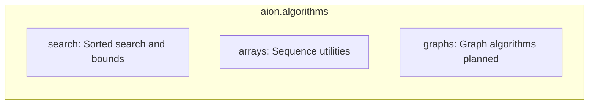

# aion.algorithms — Package Documentation

## 1. Title and overview

The **aion.algorithms** package provides public algorithmic utilities for research and educational workflows. Implementations prioritize correctness, clarity, and predictable behavior with a minimal, stable API for common algorithms used in data processing, optimization baselines, and graph-based reasoning.

**Features:**

- **search** — Searching in sorted sequences, boundary queries (lower/upper bound), and specialized search variants.
- **arrays** — List and sequence processing: flattening, chunking, windowing, deduplication, rolling sums, and related utilities.
- **graphs** — Placeholder for graph traversal and shortest-path algorithms (BFS, DFS, Dijkstra, toposort); not yet implemented.

---

## 2. Architecture

The package is organized into three submodules:

| Module   | Responsibility                                      | Status    |
|----------|-----------------------------------------------------|-----------|
| `search` | Sorted-sequence search, boundary/insertion indices  | Implemented |
| `arrays` | Sequence utilities (flatten, chunk, window, etc.)   | Implemented |
| `graphs` | Graph traversal and shortest path                   | Placeholder |



- **Package entry:** `from aion import algorithms` or `from aion.algorithms import binary_search, lower_bound, upper_bound`.
- **Direct imports:** Code may also import from submodules, e.g. `from aion.algorithms.search import is_sorted, jump_search` or `from aion.algorithms.arrays import flatten_array, chunk_array` (see `example.py`).

---

## 3. Public API summary

The following symbols are exported from the package root (`aion.algorithms`) via `__init__.py`:

| Symbol           | Module  | Description |
|------------------|---------|-------------|
| `binary_search`  | search  | Find target in sorted list; returns index or `None`. |
| `lower_bound`    | search  | First index where element ≥ target (insertion point). |
| `upper_bound`    | search  | First index where element > target. |

Additional functions are available by importing from the submodules directly (e.g. `aion.algorithms.search`, `aion.algorithms.arrays`).

---

## 4. Module reference (section structure per file)

### 4.1 search

**Purpose and design:** Deterministic, readable search implementations for sorted sequences and boundaries; O(log n) where applicable. Suitable for inspection and use in experiments.

**Section structure:**

- **Value search:** Locate a target value in a sequence.
  - `binary_search(arr, target)` — Index or `None`; O(log n).
  - `linear_search(ulist, target)` — Returns a human-readable string.
  - `jump_search(slist, step, target)` — Index or `None`; step-based jump then linear scan.
  - `exponential_search(slist, target)` — Index or `None`; expand range exponentially then binary search.
  - `ternary_search(slist, target)` — Returns a human-readable string; divides into three segments.
  - `interpolation_search(slist, target)` — Returns a human-readable string; for uniformly distributed data.
  - `roatated_search(ulist, target)` — Returns a human-readable string; for rotated sorted arrays (note: typo in name).

- **Boundary / insertion points:** Index of first position satisfying a condition.
  - `lower_bound(arr, target)` — First index where element ≥ target; O(log n).
  - `upper_bound(arr, target)` — First index where element > target; O(log n).

- **First/last occurrence:** Locate first or last index of target (return format: human-readable string).
  - `First_Occurrence(ulist, target)`
  - `Last_Occurrence(ulist, target)`
  - `First_Last_Occurrence(ulist, target)` — Returns tuple of both results.

- **Validation and peaks:**
  - `is_sorted(ulist)` — `True` if ascending or descending; O(n).
  - `find_peak_element(ulist)` — List of all peak elements (strictly greater than neighbors).

**Return types:** Some functions return an index or `None` (e.g. `binary_search`, `lower_bound`, `upper_bound`, `jump_search`, `exponential_search`). Others return human-readable strings or tuples of strings (e.g. `linear_search`, `First_Occurrence`, `ternary_search`, `interpolation_search`, `roatated_search`). Check the docstring or this table when integrating.

| Function              | Signature / key args           | Return / behavior           | Complexity  |
|-----------------------|-------------------------------|-----------------------------|------------|
| `binary_search`       | `arr`, `target`               | `Optional[int]`             | O(log n)   |
| `lower_bound`         | `arr`, `target`               | `int`                       | O(log n)   |
| `upper_bound`         | `arr`, `target`               | `int`                       | O(log n)   |
| `is_sorted`           | `ulist`                       | `bool`                      | O(n)       |
| `jump_search`         | `slist`, `step`, `target`      | `Optional[int]`             | O(√n) typ. |
| `find_peak_element`   | `ulist`                       | `List[T]`                   | O(n)       |
| `exponential_search`  | `slist`, `target`             | `Optional[int]`             | O(log n)   |
| `linear_search`       | `ulist`, `target`             | str                         | O(n)       |
| `First_Occurrence`    | `ulist`, `target`             | str                         | O(n)       |
| `Last_Occurrence`     | `ulist`, `target`             | str                         | O(n)       |
| `First_Last_Occurrence` | `ulist`, `target`           | tuple of str                | O(n)       |
| `roatated_search`     | `ulist`, `target`             | str                         | O(log n)   |
| `ternary_search`      | `slist`, `target`             | str                         | O(log n)   |
| `interpolation_search` | `slist`, `target`            | str                         | O(log log n) typ. |

---

### 4.2 arrays

**Purpose:** List and sequence processing: flattening, splitting, windowing, deduplication, aggregation, and padding. No module-level docstring in code; this README is the primary reference.

**Section structure:**

- **Flattening:** Nested lists to a single list.
  - `flatten_array(arr)` — One level; raises if `arr` is empty.
  - `flatten_deep(arr)` — Recursive; any depth.

- **Splitting and grouping:** Divide or pair elements.
  - `chunk_array(arr, size)` — Consecutive chunks of `size`; last chunk may be smaller.
  - `pairwise(arr)` — Consecutive pairs as list of tuples; requires at least two elements.

- **Windowing and rolling:** Overlapping or consecutive windows.
  - `sliding_window(arr, size)` — Generator of consecutive sublists of length `size`.
  - `rolling_sum(arr, size)` — List of sums of each consecutive window of length `size`.

- **Order and uniqueness:**
  - `remove_duplicates(arr)` — First occurrence of each value preserved; order preserved.

- **Aggregation and padding:**
  - `moving_avarage(arr)` — Arithmetic mean of numeric list (note: typo in name; known bug: uses `sum` instead of `total` in return).
  - `pad_array(arr, min_len, item)` — Extends list in place until length ≥ `min_len` by appending `item`.

**Note:** `pad_array` mutates the input list. `new_function` in the module is a stub and can be ignored.

| Function           | Main parameters     | Return type    | Brief behavior                    |
|--------------------|---------------------|----------------|-----------------------------------|
| `flatten_array`    | `arr`               | `list[Any]`    | One-level flatten                 |
| `flatten_deep`     | `arr`               | `list[Any]`    | Recursive flatten                 |
| `chunk_array`      | `arr`, `size`       | `list[list[Any]]` | Chunks of `size`              |
| `pairwise`         | `arr`               | list of tuples | Consecutive pairs                 |
| `sliding_window`   | `arr`, `size`       | generator      | Windows of length `size`          |
| `rolling_sum`      | `arr`, `size`       | `list[int]`    | Sum of each window                |
| `remove_duplicates`| `arr`               | `list[Any]`    | Unique elements, order preserved  |
| `moving_avarage`   | `arr`               | `float`        | Mean (has bug: wrong variable)    |
| `pad_array`        | `arr`, `min_len`, `item` | `list[Any]` | Pads in place to `min_len`   |

---

### 4.3 graphs

**Status:** Module is empty (placeholder).

**Intended scope:** Graph traversal and shortest-path algorithms (e.g. BFS, DFS, Dijkstra, toposort), as referenced in the package `__init__.py` comments. To be implemented in a future release.

---

## 5. Conventions and design

- **Typing:** Use of `TypeVar("T")`, `List[T]`, `Optional[int]`, `list[Any]`, `Union[int, float]` where applicable.
- **Docstrings:** NumPy-style (Parameters, Returns, Raises, Notes) in the more polished functions; some older helpers use shorter or informal docstrings.
- **Error handling:** Input validation with `TypeError` and `ValueError` (e.g. empty list, invalid `step`, non-numeric elements).
- **Input assumptions:** Sorted ascending order is required for binary search, lower_bound, upper_bound, and other sorted-search functions; unspecified order for others.

---

## 6. Dependencies

The algorithms package uses only the Python standard library (e.g. `typing`). No third-party dependencies are required.

---

## 7. Usage examples

```python
from aion.algorithms import binary_search, lower_bound, upper_bound
from aion.algorithms.search import is_sorted, jump_search, find_peak_element, exponential_search
from aion.algorithms.arrays import flatten_array, chunk_array, remove_duplicates

# Search (sorted list)
binary_search([1, 3, 5, 7, 9], 7)   # 3
lower_bound([1, 3, 5, 7, 9], 6)     # 3
upper_bound([1, 3, 5, 7, 9], 7)     # 4

# Validation and other search
is_sorted([1, 2, 3, 4])             # True
jump_search([1, 3, 5, 7, 9], step=2, target=7)  # 3
find_peak_element([1, 3, 2, 4, 1])  # [3, 4]
exponential_search([1, 3, 5, 7, 9], 9)  # 4

# Arrays
flatten_array([[1, 2], [3, 4], [5]])  # [1, 2, 3, 4, 5]
chunk_array([1, 2, 3, 4, 5, 6, 7], size=3)  # [[1,2,3], [4,5,6], [7]]
remove_duplicates([1, 2, 2, 3, 1, 4])  # [1, 2, 3, 4]
```

See `example.py` in the project root for more usage.

---

## 8. Known limitations and notes

- **graphs:** Not implemented; module is a placeholder.
- **Naming:** `roatated_search` (typo); `moving_avarage` (typo). Consider renaming in a future release.
- **Return type inconsistency (search):** Some functions return index or `None`; others return human-readable strings. Document which you use when calling.
- **In-place mutation:** `pad_array` modifies the input list.
- **Bug:** `moving_avarage` uses `sum` in the return expression instead of the computed `total`; fix in code when addressing the algorithms module.
