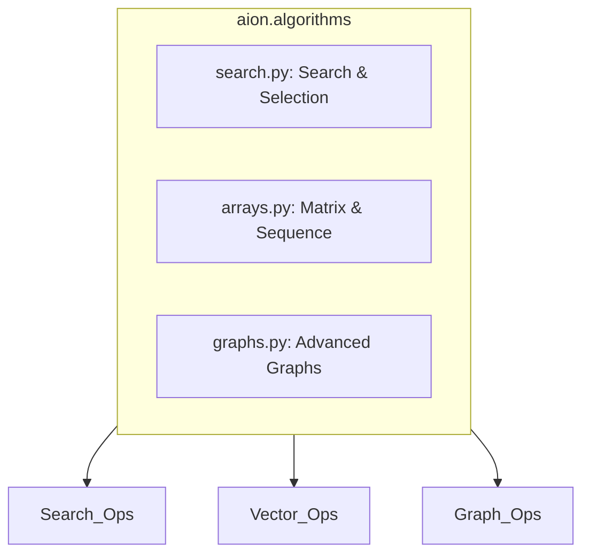

# aion.algorithms — High-Performance Algorithmic Engine

## 1. Overview

The **aion.algorithms** package is a professional-grade suite of algorithmic primitives designed for high-performance data processing, optimization, and structural reasoning. It provides a robust foundation for research and production workflows, prioritizing mathematical correctness and computational efficiency.

**Core Capabilities:**

- **Search Intelligence**: From classic binary search to advanced optimization (BS on answer) and multi-pattern string matching.
- **Sequence Engineering**: Robust array processing, matrix operations, and statistical normalization utilities.
- **Graph Processing**: A complete suite of graph algorithms including pathfinding, connectivity, network flow, and centrality.

---

## 2. Architecture

The package is organized into three specialized modules, each following strict PEP8 and Ruff standards.

| Module   | Domain                                      | Implementation Level |
|----------|---------------------------------------------|----------------------|
| `search` | Sequence search, optimization, string matching | Professional         |
| `arrays` | Vector/Matrix ops, stats, sequence utils    | Professional         |
| `graphs` | Connectivity, flow, pathfinding, centrality | Professional         |



---

## 3. Module Reference

### 3.1 Search & Selection (`search.py`)
Deterministic, $O(\log n)$ search implementations and selection primitives.

- **Sequence Search**: `binary_search`, `ternary_search`, `jump_search`, `exponential_search`, `interpolation_search`, `fibonacci_search`.
- **Optimization**: `integer_sqrt`, `nth_root`, `koko_eating_bananas`, `ship_capacity`, `split_array_max_sum`.
- **String Matching**: `kmp_search`, `rabin_karp`, `boyer_moore_simple`, `z_algorithm`, `aho_corasick_simple`, `bitap_search`.
- **Selection**: `quickselect`, `find_median_unordered`, `find_k_closest_elements`.

### 3.2 Matrix & Sequence Engineering (`arrays.py`)
Optimized utilities for list manipulation and numerical analysis.

- **Structural**: `flatten_array`, `flatten_deep`, `chunk_array`, `pairwise`, `sliding_window`, `pad_array`.
- **Matrix Operations**: `matrix_transpose`, `matrix_multiply`, `matrix_diagonal_sum`.
- **Statistical & Normalization**: `moving_average`, `z_score_normalization`, `min_max_scaling`, `rolling_sum`.
- **Analysis**: `is_monotonic`, `find_all_peaks`, `longest_increasing_subsequence`.

### 3.3 Advanced Graph Processing (`graphs.py`)
Professional-grade graph theory implementations.

- **Traversal & Pathfinding**: `bfs`, `dfs`, `dijkstra`, `a_star`, `bellman_ford`, `floyd_warshall`, `bidirectional_bfs`.
- **Connectivity**: `tarjan_scc`, `kosaraju_scc`, `connected_components`, `is_bipartite`, `find_bridges`.
- **Spanning Trees**: `prim_mst`, `kruskal_mst`.
- **Network Flow & Centrality**: `ford_fulkerson` (Max Flow), `pagerank`.

---

## 4. Usage Examples

```python
from aion.algorithms import (
    binary_search, 
    kmp_search, 
    dijkstra, 
    matrix_multiply,
    moving_average
)

# 1. Search with KMP
text = "ABC ABCDAB ABCDABCDABDE"
pattern = "ABCDABD"
indices = kmp_search(text, pattern) # [15]

# 2. Graph Pathfinding
graph = {
    'A': [('B', 1), ('C', 4)],
    'B': [('C', 2), ('D', 5)],
    'C': [('D', 1)],
    'D': []
}
dist, path = dijkstra(graph, 'A') # {'A': 0, 'B': 1, 'C': 3, 'D': 4}, {'D': 'C', 'C': 'B', 'B': 'A'}

# 3. Array Processing
data = [10, 20, 30, 40, 50]
avg = moving_average(data) # 30.0
```

---

## 5. Design Principles

- **Type Integrity**: Strict use of `TypeVar`, `Optional`, and `Union` for robust static analysis.
- **Consistency**: All functions follow `snake_case` naming and standardized return patterns.
- **Optimal Complexity**: Algorithms are implemented using their theoretically optimal time and space complexities.
- **Zero Dependencies**: Core logic relies exclusively on the Python standard library.
