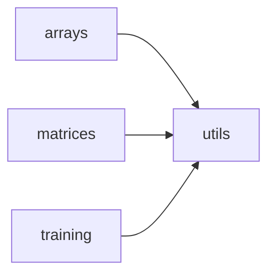

# AION Visualization

Research-friendly plotting for 1D/2D data and training metrics. The module is lightweight, backend-safe (CLI, notebooks, CI), and returns matplotlib `Figure` objects so you can display or save plots as needed.

**Design:**

- **Backend-safe**: In non-interactive environments (e.g. headless servers, CI), display is skipped gracefully instead of raising.
- **Optional display**: Every plot function accepts `show=True`; set `show=False` when you only want to save or further modify the figure.
- **Consistent API**: Common parameters `title` and `show` across plot functions; shared helpers for finalization and saving.

---

## Table of contents

- [What you need](#what-you-need)
- [Installation](#installation)
- [Step-by-step setup](#step-by-step-setup)
- [Quick start](#quick-start)
- [How to use (step by step)](#how-to-use-step-by-step)
- [Package layout](#package-layout)
- [API reference](#api-reference)
  - [Arrays](#arrays)
  - [Matrices](#matrices)
  - [Training](#training)
  - [Utils](#utils)
- [Usage notes](#usage-notes)
- [Step-by-step workflows](#step-by-step-workflows)
- [Detailed examples](#detailed-examples)

---

## What you need

Before using the visualization module, ensure you have:

1. **Python**: Version 3.8 or higher (same as the main AION package).
2. **pip**: So you can install the package and its extras.
3. **Optional but recommended**: A virtual environment (e.g. `venv` or `conda`) so visualization dependencies do not conflict with other projects.

**What the visualization module needs at runtime:**

- **matplotlib** (>= 3.5.0): Used for all plotting. Without it, imports will fail.
- **numpy**: Used for array/matrix plots (arrays, matrices, and some training helpers). Required for most functions.

If you install with the `[viz]` or `[full]` extra, these are installed automatically. If you install only the base package (`pip install aqwel-aion`), you must install matplotlib and numpy yourself before using `aion.visualization`.

---

## Installation

**Step 1.** Install the main package with the visualization extra so matplotlib (and optional seaborn) are available:

```bash
pip install aqwel-aion[viz]
```

For the full stack (AI/ML + docs + visualization):

```bash
pip install aqwel-aion[full]
```

**Step 2.** Confirm versions (optional). In a Python shell or script:

```python
import matplotlib
import numpy
print(matplotlib.__version__)  # e.g. 3.5.0 or higher
print(numpy.__version__)
```

**Dependencies for this subpackage:** `matplotlib>=3.5.0`, `numpy`. The `[viz]` extra also pulls in `seaborn>=0.11.0`.

---

## Step-by-step setup

Follow these steps once per environment (e.g. your machine or a CI runner).

1. **Create and activate a virtual environment (recommended).**
   - With venv:
     ```bash
     python3 -m venv .venv
     source .venv/bin/activate   # Linux/macOS
     # or:  .venv\Scripts\activate   # Windows
     ```
   - With conda:
     ```bash
     conda create -n aion python=3.10
     conda activate aion
     ```

2. **Install the package with the viz extra.**
   ```bash
   pip install aqwel-aion[viz]
   ```

3. **Verify the visualization module is importable.**
   ```bash
   python -c "from aion.visualization import plot_array; from aion.visualization.utils import save_plot; print('OK')"
   ```
   If you see `OK`, you can use the module.

4. **Optional: install from source (e.g. for development).**
   From the repository root:
   ```bash
   pip install -e ".[viz]"
   ```

---

## Quick start

```python
from aion.visualization import plot_array
from aion.visualization.utils import save_plot

fig = plot_array([1, 3, 2, 5, 4], title="Basic array", show=False)
save_plot(fig, "out.png")
```

---

## How to use (step by step)

Use this sequence whenever you want to create a plot.

**Step 1: Decide what you want to plot.**

- **1D sequence** (e.g. loss over time, a single feature): use a function from the **Arrays** section (e.g. `plot_array`, `plot_histogram`, `plot_scatter`).
- **2D matrix** (e.g. weights, correlation, confusion matrix): use a function from the **Matrices** section (e.g. `plot_matrix_heatmap`, `plot_confusion_matrix`).
- **Training metrics** (e.g. loss and accuracy per epoch): use a function from the **Training** section (e.g. `plot_training_history`, `plot_metric`).

**Step 2: Prepare your data in the right shape.**

- **Arrays**: Pass a sequence of numbers (list, tuple, or 1D numpy array). Example: `[1.0, 2.0, 3.0]` or `np.array([1, 2, 3])`.
- **Two arrays (e.g. x and y)**: Same length. Example: `x = [1, 2, 3]`, `y = [4, 5, 6]`.
- **Matrix**: List of lists or 2D array. Example: `[[1, 2], [3, 4]]`.
- **Training history**: A dict mapping metric names to lists of values. Example: `{"loss": [0.5, 0.3, 0.2], "accuracy": [0.7, 0.8, 0.9]}`.

**Step 3: Import the function(s) you need.**

- Import plot functions from `aion.visualization`:
  ```python
  from aion.visualization import plot_array, plot_histogram, plot_matrix_heatmap, plot_training_history
  ```
- If you want to save figures to disk, also import:
  ```python
  from aion.visualization.utils import save_plot
  ```

**Step 4: Call the plot function with your data.**

- Pass your data as the first argument(s). Add `title="My title"` if you want a title.
- Choose what happens after the plot is created:
  - **Show in a window (e.g. on your laptop):** use `show=True` (default). The plot will try to open in a window; in headless environments this is safely ignored.
  - **Do not show, only save or reuse the figure:** use `show=False`. The function still returns a matplotlib `Figure`; no window is opened.

Example:

```python
fig = plot_array([1, 3, 2, 5, 4], title="My curve", show=False)
```

**Step 5: Either display or save the figure.**

- **To display:** If you used `show=True`, the plot is already shown by the function. You do not need to do anything else (unless you are in a notebook and want to control when it appears).
- **To save to a file:** Use `save_plot(fig, path)`:
  ```python
  save_plot(fig, "my_plot.png")
  ```
  You can also pass `dpi=150` (or another number) for resolution.

- **To reuse the figure in your own code:** Keep the returned `fig` and use matplotlib’s API (e.g. add more axes, change labels) before calling `save_plot` or `plt.show()`.

**Summary:** Prepare data → import function → call with data and `show=False` if you only want to save → then call `save_plot(fig, path)` or leave `show=True` to display.

---

## Package layout

| Module | Purpose |
|--------|--------|
| `arrays` | 1D numerical data: line plots, histograms, scatter, distributions, rolling stats, etc. |
| `matrices` | 2D data: heatmaps, confusion matrices, surfaces, attention maps, sparsity. |
| `training` | Training histories: loss/accuracy over epochs, train vs val, learning rate, early stopping. |
| `utils` | Shared helpers: `finalize_plot`, `save_plot`. |

All plot functions use `utils.finalize_plot` for title, grid, and optional display; use `utils.save_plot` to write figures to disk.



---

## API reference

Every plot function returns a `matplotlib.figure.Figure` and, when `show=True`, may display it (safely no-op in headless environments).

### Arrays

One-dimensional numerical data (lists, tuples, array-likes).

| Function | Description |
|----------|-------------|
| `plot_array(array, title=None, show=True)` | Plot a 1D array as a line chart (index vs value). |
| `plot_histogram(array, bins=10, title=None, show=True)` | Histogram of value distribution. |
| `plot_scatter(x, y, title=None, show=True)` | Scatter plot of two variables. |
| `plot_multiple_arrays(arrays, labels=None, title=None, show=True)` | Multiple 1D arrays on one figure. |
| `plot_array_with_mean(array, title=None, show=True)` | 1D array with mean as a horizontal line. |
| `plot_running_mean(array, window_size=10, title=None, show=True)` | Running (moving) mean of a 1D array. |
| `plot_boxplot(array, title=None, show=True)` | Boxplot for a 1D array. |
| `plot_density(array, bins=30, title=None, show=True)` | Density curve from a normalized histogram. |
| `plot_cdf(array, title=None, show=True)` | Cumulative distribution function. |
| `plot_error_bars(x, y, yerr, title=None, show=True)` | Line plot with error bars. |
| `plot_rolling_std(array, window_size=10, title=None, show=True)` | Rolling standard deviation. |
| `plot_min_max_band(array, window_size=10, title=None, show=True)` | Rolling min/max band (filled region). |
| `plot_autocorrelation(array, max_lag=40, title=None, show=True)` | Autocorrelation of a 1D array. |
| `plot_quantiles(array, qs=(0.25, 0.5, 0.75), title=None, show=True)` | Quantiles as horizontal lines. |
| `plot_scatter_with_fit(x, y, title=None, show=True)` | Scatter with linear regression fit. |
| `plot_dual_axis(x, y1, y2, label1="Series 1", label2="Series 2", title=None, show=True)` | Two series with dual y-axes. |

### Matrices

Two-dimensional numerical data (heatmaps, confusion matrices, attention, etc.).

| Function | Description |
|----------|-------------|
| `plot_matrix_heatmap(matrix, title=None, show=True)` | 2D matrix as a heatmap. |
| `plot_confusion_matrix(cm, labels=None, title=None, show=True)` | Confusion matrix for classification. |
| `plot_matrix_surface(matrix, title=None, show=True)` | 3D surface of a 2D matrix. |
| `plot_matrix_contour(matrix, title=None, show=True)` | Contour map of a 2D matrix. |
| `plot_matrix_with_values(matrix, title=None, show=True)` | Heatmap with annotated cell values. |
| `plot_correlation_matrix(data, labels=None, title=None, show=True)` | Correlation matrix from 2D data. |
| `plot_similarity_matrix(data, metric="cosine", title=None, show=True)` | Similarity matrix (cosine or dot). |
| `plot_matrix_histogram(matrix, bins=30, title=None, show=True)` | Histogram of matrix element values. |
| `plot_masked_heatmap(matrix, mask, title=None, show=True)` | Heatmap with boolean mask (masked cells hidden). |
| `plot_confusion_matrix_normalized(cm, labels=None, title=None, show=True)` | Row-normalized confusion matrix. |
| `plot_attention_map(weights, tokens=None, title=None, show=True)` | Attention weight matrix with optional token labels. |
| `plot_matrix_sparsity(matrix, title=None, show=True)` | Sparsity pattern (non-zero pattern). |

### Training

Training and experiment metrics over epochs or steps.

| Function | Description |
|----------|-------------|
| `plot_training_history(history, show=True)` | All metrics from a history dict on one figure. |
| `plot_metric(history, metric, title=None, show=True)` | Single metric from a history dict. |
| `plot_train_vs_val(train, val, title=None, show=True)` | Training vs validation on same axes. |
| `plot_learning_rate(lr_values, title=None, show=True)` | Learning rate over steps/epochs. |
| `plot_metric_with_best(history, metric, mode="min", title=None, show=True)` | One metric with best value highlighted. |
| `plot_metrics_grid(history, cols=2, title=None, show=True)` | Multiple metrics in a subplot grid. |
| `plot_confidence_band(mean, std, title=None, show=True)` | Mean curve with ±std confidence band. |
| `plot_early_stopping(history, metric, patience, mode="min", title=None, show=True)` | Metric with early-stop and best point marked. |
| `plot_epoch_time(times, title=None, show=True)` | Epoch duration over time. |

### Utils

Shared helpers (import from `aion.visualization.utils`).

| Function | Description |
|----------|-------------|
| `finalize_plot(title, show)` | Apply title, grid, and optionally display; backend-safe (catches display errors). |
| `save_plot(fig, path, dpi=300)` | Save a figure to disk with tight bounding box. |

---

## Usage notes

- **Saving instead of displaying**: Use `show=False` in any plot function, then `save_plot(fig, path)` so plots work in scripts, CI, or servers.
- **Import pattern**: `from aion.visualization import plot_array, plot_histogram, ...` and `from aion.visualization.utils import save_plot`.
- **Backend**: In headless environments, `plt.show()` inside `finalize_plot` is wrapped in try/except and ignored on failure.

---

## Step-by-step workflows

### Workflow A: Save plots to files (script or CI)

Use this when you are running a script in a terminal, on a server, or in CI, and you want PNG (or other) files written to disk.

1. Import the plot functions and `save_plot`:
   ```python
   from aion.visualization import plot_array, plot_histogram
   from aion.visualization.utils import save_plot
   ```
2. Create each figure with `show=False`:
   ```python
   fig1 = plot_array([1, 2, 3, 4, 5], title="Curve", show=False)
   fig2 = plot_histogram([1, 1, 2, 2, 2, 3], bins=3, title="Counts", show=False)
   ```
3. Save each figure to a path:
   ```python
   save_plot(fig1, "curve.png")
   save_plot(fig2, "histogram.png")
   ```
4. Run the script: `python my_script.py`. The files will appear in the current working directory (or the paths you passed).

### Workflow B: Show plots in a Jupyter notebook

Use this when you want to see plots inline in a notebook.

1. Import the functions you need (you usually do not need `save_plot` unless you also want to export files):
   ```python
   from aion.visualization import plot_array, plot_training_history
   ```
2. Call the function with `show=True` (default). The plot will be drawn inline when the cell runs:
   ```python
   plot_array([1, 3, 2, 5, 4], title="Notebook plot")
   ```
3. To save a copy from the notebook as well, keep the returned figure and call `save_plot`:
   ```python
   fig = plot_array([1, 3, 2, 5, 4], title="Notebook plot", show=False)
   save_plot(fig, "notebook_export.png")
   ```

### Workflow C: Multiple plots in one script (save all)

Use this when you want to produce several different plots and save each to a different file.

1. Import all plot functions you need and `save_plot`.
2. Prepare your data (lists, matrices, or history dicts).
3. For each plot:
   - Call the plot function with your data and `show=False`.
   - Immediately call `save_plot(fig, "unique_filename.png")` (and optionally `dpi=150` or similar).
4. Example structure:
   ```python
   from aion.visualization import plot_array, plot_histogram, plot_matrix_heatmap
   from aion.visualization.utils import save_plot

   data = [1, 2, 3, 4, 5]
   save_plot(plot_array(data, show=False), "step1_array.png")
   save_plot(plot_histogram(data, bins=5, show=False), "step2_hist.png")
   save_plot(plot_matrix_heatmap([[1, 2], [3, 4]], show=False), "step3_heatmap.png")
   ```

---

## Detailed examples

### Example 1: Plot a 1D array and save it

**Goal:** Plot a simple curve and save it as `my_curve.png`.

**Step 1.** Create a Python file (e.g. `plot_curve.py`).

**Step 2.** Add imports and data:
```python
from aion.visualization import plot_array
from aion.visualization.utils import save_plot

values = [10, 15, 12, 18, 14, 20, 16]
```

**Step 3.** Create the figure without showing a window, then save:
```python
fig = plot_array(values, title="Sample curve", show=False)
save_plot(fig, "my_curve.png")
```

**Step 4.** Run: `python plot_curve.py`. Check that `my_curve.png` was created in the same directory.

---

### Example 2: Plot training loss and accuracy from a history dict

**Goal:** You have a training history (e.g. from Keras or a custom loop) and want one figure with both loss and accuracy.

**Step 1.** Have your history as a dict of metric name → list of values per epoch:
```python
history = {
    "loss": [0.8, 0.5, 0.3, 0.2, 0.15],
    "accuracy": [0.6, 0.75, 0.82, 0.88, 0.91]
}
```

**Step 2.** Import and call `plot_training_history`:
```python
from aion.visualization import plot_training_history
from aion.visualization.utils import save_plot

fig = plot_training_history(history, show=False)
save_plot(fig, "training.png")
```

**Step 3.** Run your script. `training.png` will show both curves with a legend.

---

### Example 3: Plot a confusion matrix with class labels

**Goal:** Visualize a confusion matrix (e.g. from a classifier) with row/column labels.

**Step 1.** Define the matrix (rows = true class, columns = predicted class) and labels:
```python
cm = [
    [50,  5,  2],   # true class A: 50 predicted A, 5 B, 2 C
    [ 3, 45,  4],   # true class B
    [ 1,  2, 48],   # true class C
]
labels = ["Cat", "Dog", "Bird"]
```

**Step 2.** Import and plot:
```python
from aion.visualization import plot_confusion_matrix
from aion.visualization.utils import save_plot

fig = plot_confusion_matrix(cm, labels=labels, title="Confusion matrix", show=False)
save_plot(fig, "confusion.png")
```

---

### Example 4: Scatter plot with linear fit

**Goal:** Two variables `x` and `y`; show scatter points and a fitted line.

**Step 1.** Prepare equal-length lists:
```python
x = [1, 2, 3, 4, 5, 6, 7]
y = [1.2, 2.1, 2.8, 4.2, 4.9, 6.1, 7.0]
```

**Step 2.** Use `plot_scatter_with_fit`:
```python
from aion.visualization import plot_scatter_with_fit
from aion.visualization.utils import save_plot

fig = plot_scatter_with_fit(x, y, title="Scatter with fit", show=False)
save_plot(fig, "scatter_fit.png")
```

---

### Example 5: Compare train vs validation loss

**Goal:** Two sequences, one for training loss and one for validation loss per epoch.

**Step 1.** Have two lists of the same length:
```python
train_loss = [0.9, 0.6, 0.4, 0.3, 0.25]
val_loss   = [0.95, 0.65, 0.5, 0.45, 0.44]
```

**Step 2.** Use `plot_train_vs_val`:
```python
from aion.visualization import plot_train_vs_val
from aion.visualization.utils import save_plot

fig = plot_train_vs_val(train_loss, val_loss, title="Train vs Val Loss", show=False)
save_plot(fig, "train_vs_val.png")
```

---

### Where to find more

- **Runnable script**: The repository root contains [example.py](../../example.py) that demonstrates array, histogram, scatter, multiple arrays, mean, matrix heatmap, confusion matrix, and training history plots; all use `show=False` and `save_plot` so they run in terminal or CI.
- **Sample outputs**: Pre-generated example images are in [examples_visualization/](examples_visualization/) (e.g. `example_array.png`, `example_histogram.png`, `example_matrix_heatmap.png`, `example_training_history.png`).
